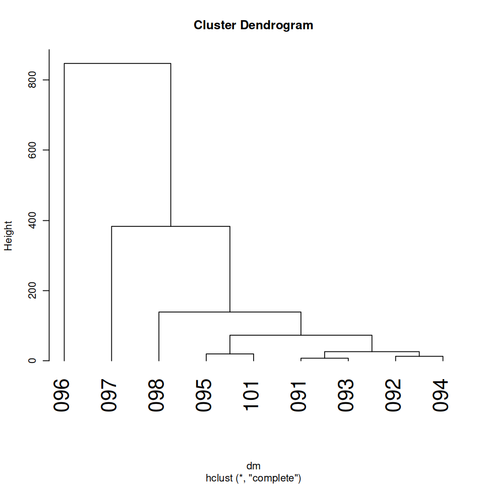
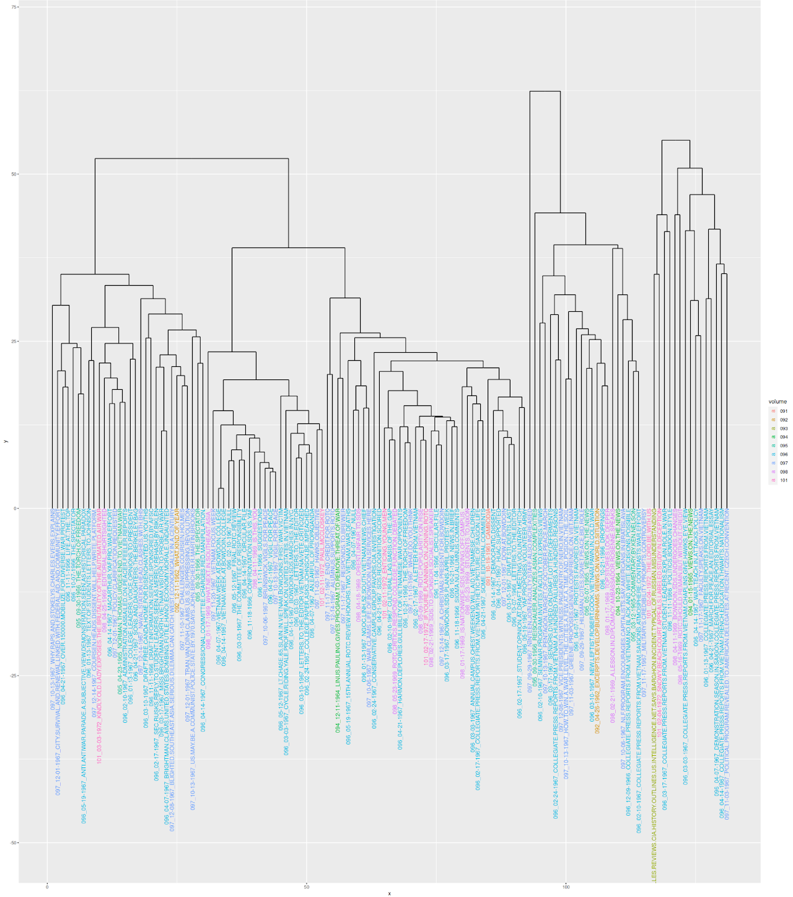
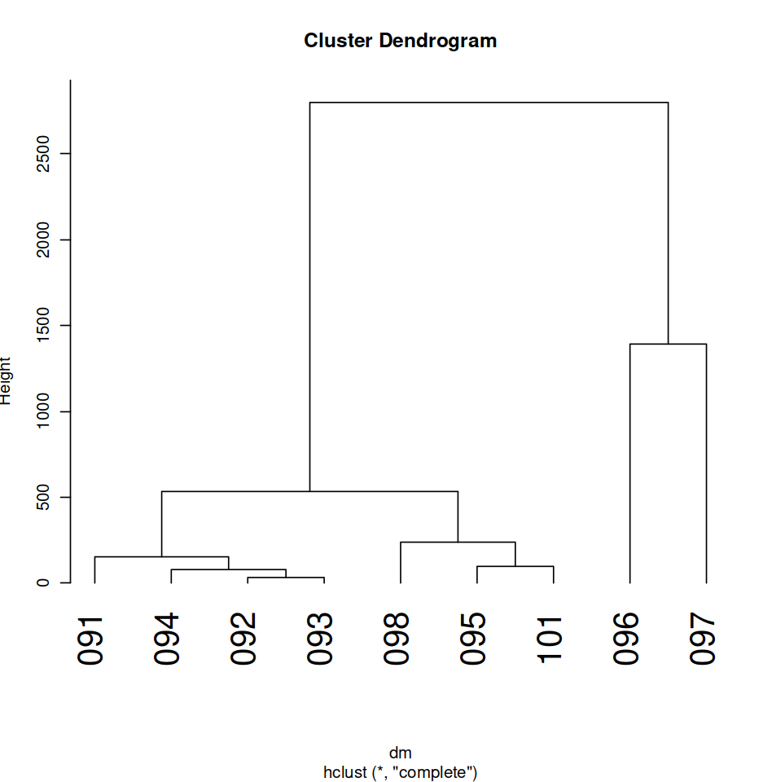
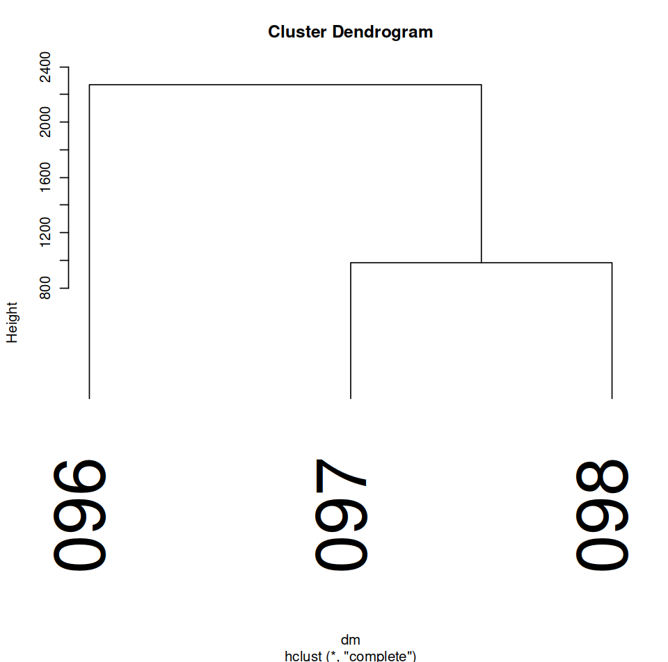
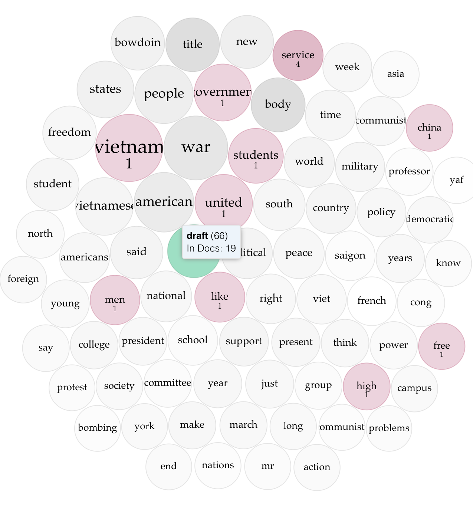
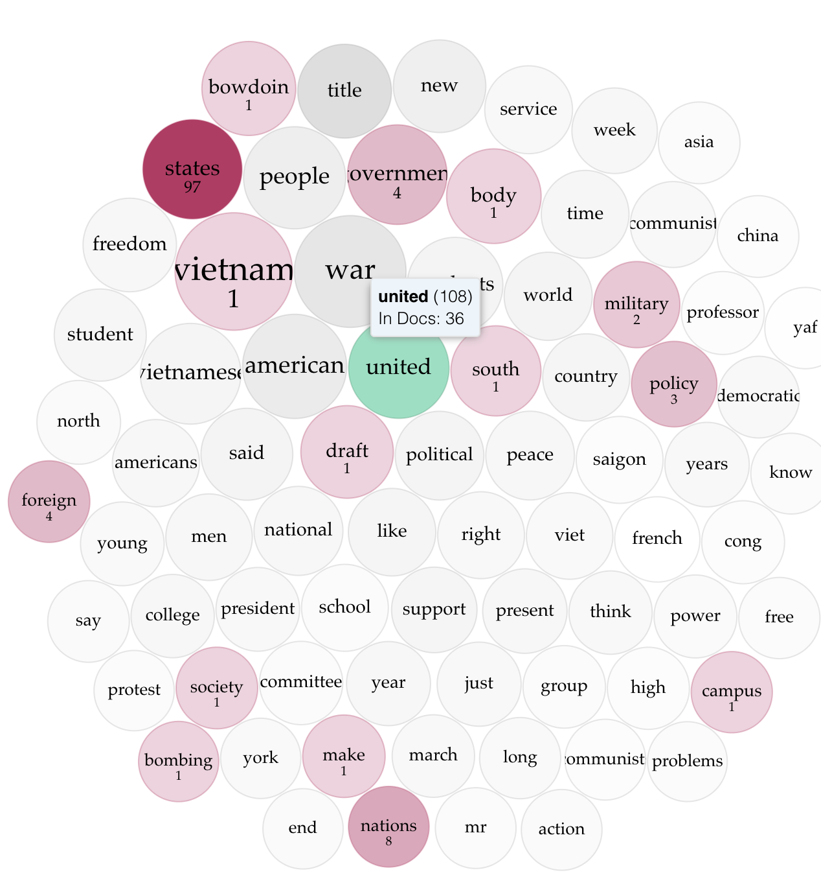
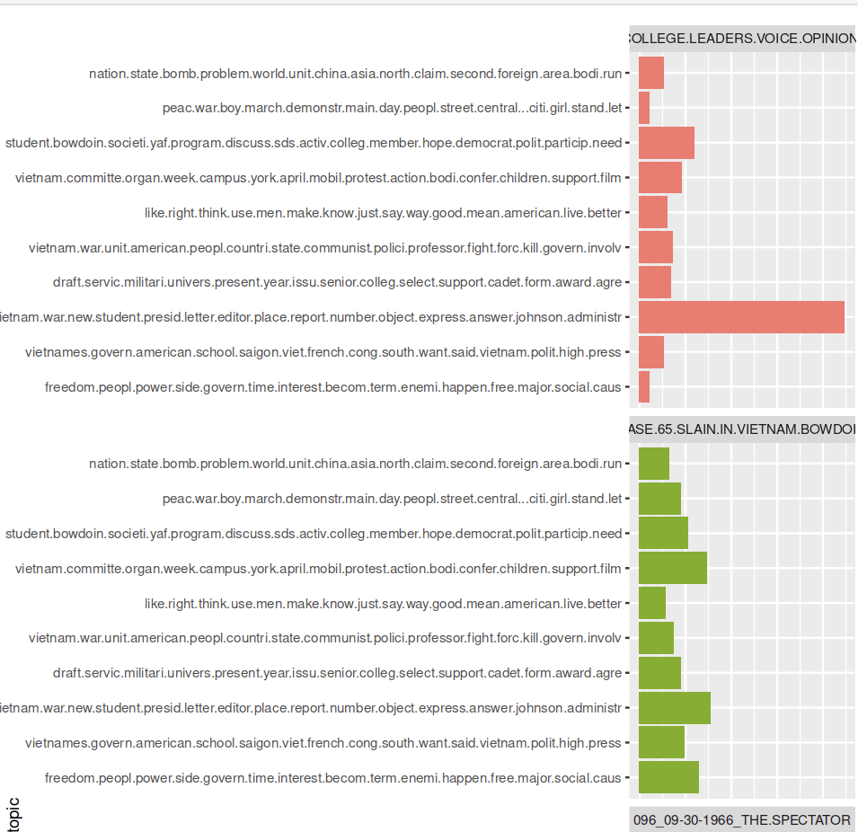
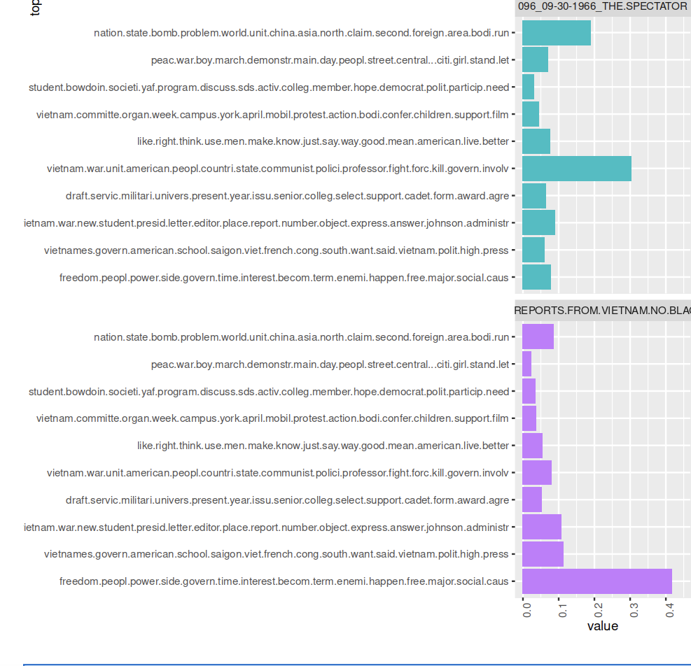

*An exploratory, skeptical digital text analysis of the Bowdoin Orient coverage of the Vietnam War between 1961-75*

*Research project by Mason Daugherty, Charlie Galicich, and Sachin Maharaj.*

# Introduction

The Vietnam War was a highly contentious and polarizing conflict that took place from 1955 to 1975, involving the United States and its allies against North Vietnam and the Viet Cong. It had profound social, political, economic, and cultural impacts on American society. Socially, the Vietnam War era was marked by widespread protests, student activism, and a generation gap as young people questioned traditional authority and challenged the government's policies. Anti-war sentiment and draft resistance movements grew, leading to significant social upheaval and divisions within communities. Politically, the war deeply influenced public opinion and political discourse. It sparked debates over the legitimacy of U.S. involvement, foreign policy decisions, and the morality of war itself. The government's handling and media coverage of the war became subjects of intense scrutiny and criticism. Finally, the war's impact on the economy, including inflation and the allocation of resources, was a central subject of concern and debate.

Our project's connection to other liberal arts disciplines is significant. It combines historical analysis, cultural studies, and content analysis to examine the Vietnam War's impact on the college community, the role of student journalism, and the broader social and cultural landscape at Bowdoin at the time. It highlights the importance of interdisciplinary approaches in understanding complex historical events and their cultural ramifications. Additionally, it provides an avenue for exploring the power of media in shaping public discourse and the role of liberal arts education in fostering critical thinking, civic engagement, and the exploration of diverse perspectives. *The Bowdoin Orient*'s coverage of the war had the power to shape public opinions, behaviors, and even decisions made by campus officials.

By reading a large collection of article texts one can formally determine not only the topics being discussed but *how* they were discussed. *The Bowdoin Orient* has always solicited articles that students of the college write; in this analysis, their voices in the milieu of the social upheaval that accompanied the war are clearly heard, revealing a slice of life on Bowdoin's campus in this turbulent time and the differences of opinion held in the community. Without the use of digital interpretation tools, this would be a time-consuming process that might overlook large trends among volumes and articles. Additionally, employing digital tools has allowed us to create easy-to-replicate models and limit biased interpretations of *The Orient*'s Vietnam War coverage. Furthermore, the creation of this corpus of *Bowdoin Orient* articles has added significantly to other disciplines' future use by providing digitized versions of these articles to be used for further studies. Overall, this corpus serves as an incomplete but portable abstraction of how various students perceived the Vietnam War and the relation which they held personally and institutionally to these global events.

> “The process of text analysis, with its computational tools and techniques, is as much about understanding our interpretations of a text, by formalizing them, as it is about the text itself." - Hermeneutica (Rockwell, Sinclair. Ch. 9)

The corpus our group created includes articles published between 1961-75 that specifically focus on the war, as well as ones covering related topics such as protests, draft resistance, and anti-war activism. While we began our scraping in the year 1955, the historic beginning of the conflict, *The Bowdoin Orient* did not mention "Vietnam" in its articles until 1961, so thus our corpus begins here. The articles cover a wide range of formats, including news reports, opinion pieces/columns, editorials, letters to the editor, interviews, and campus lectures. Together these articles offer a comprehensive view of the campus by incorporating a multiplicity of parties and numerous stakeholders, mixing reporting of the war and the United States's role in it while also discussing reactions local to Bowdoin. Articles discussing the Vietnam War are texts created via a product of abstraction, wherein we are creating an embedded model of reality. Through our hermeneutic analysis (detailed later), we have utilized the R 4.2 programming language files and Voyant Tools to carry out text analysis on select articles within this corpus. The models derived from these programs showcase the embedded model of reality which we examine. In this case, the realities embedded are the lived experiences and concerns of *Orient* writers in the 1960s & 70s.

At large, we are using analysis of texts as social information: we are looking at reflections of the knowledge found in articles, written by their authors. This type of analysis is valuable because the articles can provide reliable information about the social reality of the era, but the quality of information varies based on the knowledge and perspective of the individual writing it.

Our project encompasses textual and contextual levels of analysis on our corpus of texts. Overall borrowing terms from Ignatow and Mihalcea in their book *An Introduction to Text Mining*, our analysis includes discourse position analysis and critical discourse analysis. We understand discourse analysis as presupposing that texts lack meaning without careful consideration of social and historical context (Ignatow & Mihalcea 2018). For our corpus and analyses, we see these articles as a product of the Vietnam War as experienced at Bowdoin College during the time period they were written in. This type of analysis is valuable because the articles can provide reliable information about the social reality of the era, but the quality of information varies based on the knowledge and perspective of the individual writing it. Additionally, we acknowledge that the articles themselves are a product of the editors, authors, and editorial board of *The Bowdoin Orient* at the time they were written. This adds another layer to discourse analysis since we must recognize the articles were also impacted by editorial decisions (we are only studying articles that made it to print). Furthermore, as authors, we are using the hindsight that a 2023 perspective shines on the war, so, as a result, we engage in critical discourse analysis, as we are presupposing the context of articles based on contemporary understandings of the history, as opposed to what was known at the time of publication.

For critical discourse analysis, we chose to study *The Bowdoin Orient*’s coverage of the Vietnam War because it is part of the collegiate and Mid-coast Maine discussion of the Vietnam War at the time. We recognize these articles are artifacts of their time and place when we discuss our analysis of these articles in later sections. For our critical discourse analysis, we do assume that these articles are suitable representations of the conversation on the Vietnam War and *The Bowdoin Orient* published worthwhile articles.  

Finally, the project will involve some measure of content analysis. This quantitative-based modeling of texts will allow for the extraction of more features of *Bowdoin Orient* articles related to the Vietnam War; is the vocabulary used within the articles consistent? Does it seem there is a certain style or set of actors that appear frequently in these articles? Taking this approach, less based on context and more based on the texts themselves, allows for the patterns to emerge first, and those patterns can then be connected to context.

**High-Level Research Question**: How did *The Bowdoin Orient* cover the Vietnam War?

**High-Level Hypothesis:** *The Orient*'s coverage of the Vietnam War likely reflects a diversity of perspectives and opinions within the campus community. It may highlight the social upheaval, student activism, and differing viewpoints surrounding the war.

This project seeks to generate idiographic knowledge, as we are attempting to describe and explain *The Orient*'s coverage of the war.

# Corpus

*The Bowdoin Orient* is the student-run newspaper of Bowdoin College, a private liberal arts college in Brunswick, Maine. It is one of the oldest continuously-published college newspapers in the United States, having been established in 1871. The paper is published weekly during the academic year and monthly during the summer. *The Orient* covers news, features, opinions, and arts and entertainment related to the Bowdoin College community. The paper is staffed by Bowdoin students, who are responsible for reporting, writing, editing, designing, and publishing the paper.

**Creation Strategy:**
Our group followed a relevance-based collection methodology to acquire articles. A relevance-based collection methodology in digital text analysis refers to a systematic approach used to gather and select relevant documents or textual data, a process that involves defining research question(s) and filtering/screening documents according to it. Since we're matching documents to their relevance to our research questions, which center around the Vietnam War, we chose to include all articles that included matches to our search term, `Vietnam`. More plainly, we used the built-in search features of Apple's Preview.app and Adobe Acrobat to identify articles for scraping/transcription.

## Composition

**Publication:** *The Bowdoin Orient*

**OCLC Number:** [`1013419982`](https://www.worldcat.org/oclc/1013419982)

**Issue Range Searched:** `v.084 - 105`

**Date Range Searched:** `01/1955 - 12/1975`

**Issue Range Actual:** `v.091 - 105`

**Date Range Actual:** `10/12/1961 - 11/14/1975`

**Search Term:** `Vietnam` (match-case not enabled)

**Size:** 133 articles (incomplete, roughly 60% of the way done)

**Language:** `eng` (ISO 639-2 Code)

**Source:** [Bowdoin College Digital Commons](https://digitalcommons.bowdoin.edu/bowdoinorient/)

**Collection Method:** `text extraction`, `manual collection`, `crowd-sourcing`

**Workflow & Quality Assurance:**

Bowdoin's Digital Commons makes *The Bowdoin Orient* available in PDF files each representing a volume. The publishing cycle, on average, spanned April-April. Volumes 084-105 were downloaded for this project. The 21 volumes were divided up evenly amongst the three group members so that each person extracted from 7 issues. Each volume was opened in either Adobe Acrobat where Optical Character Recognition (OCR) algorithms were used to query for the search term `Vietnam`. Each article containing the search term was mined using a crowd-sourced manual collection of the article's text (via copy & paste into a UTF-8 encoded .txt file). No matches were returned until v.091, although v.084-090 were searched.
We are assuming that *The Orient* did not make any spelling mistakes when writing `Vietnam`. Articles with these mistakes, would not have returned in our searches, and, as a result, are omitted from this corpus and subsequent analysis.

**Ethics Statement:**

The data collected for this project is derived from the publicly accessible archives of **The Bowdoin Orient**, found in the Bowdoin College Digital Commons, provided by the George J. Mitchell Department of Special Collection & Archives at the Bowdoin Library. The aim of the project is to gain a historical understanding of the attitudes and sentiments towards the Vietnam War in the Bowdoin community, as reflected in **The Orient**. The analyses will be conducted in a manner that respects the integrity of the original text and the context in which it was produced. We are aware of the potential for bias and subjectivity in the interpretation of the data, and we will strive for transparency, accuracy, and reproducibility in our methodology and results. As far as possible, we will avoid making any definitive or generalized claims about the sentiments and attitudes of the Bowdoin community based solely on the data from the newspaper. Our findings will be presented in a manner that respects the diversity and complexity of views and experiences that may have existed within the community during this period.

## Methodology

* Removing irrelevant tags: `@TITLE=` and `@BODY=`
* Lowercasing all text
* Removing punctuation and special characters
* Removing stopwords - common words like `the`, `and`, `a`, etc., that do not carry significant meaning and are therefore not useful for the analysis


*Example of an article being queried for the search term. **Source: pg. 35. v.091 PDF***

Each article was cross-checked for typos and punctuation errors. Due to the poor archival and digitization quality of many of the volumes, the OCR algorithms often failed to work reliably. In these cases, manual transcription of the article text was used (via typing out each word by hand). In cases where words were not clearly discernible, as shown in the example below, a best guess was applied given the context of the preceding and following sentences. We acknowledge that this is a subjective interpretation and leads to potential inaccuracy in the data, though luckily no article had its core meaning changed as a result of this.


*Example of poor archiving/digitization. **Source: pg. 43, v.091 PDF***

The select terms `U.S`, `U.S.A.`, and `Viet Nam`, were re-written as `United States`, `United States of America`, and `Vietnam` respectively. Due to the physical constraints of print publication, historical newspapers such as `The Bowdoin Orient` used abbreviations. Inconsistent terminology usage without standardization will result in measurements that are not wholly representative of the text. Furthermore, the process of removing "stop words" would consider `us` and `US` as stop words, even if they were meant as abbreviations.

### Composition & Demarcation Assessment

#### Strengths

* *The Bowdoin Orient* is a well-established student-run newspaper with a long history, providing a potentially unique perspective on events and issues.
* The data covers a significant time period (1955-1975) during which the Vietnam War occurred, providing a comprehensive overview of the newspaper's coverage of the conflict.

#### Weaknesses

* The search term used (`Vietnam`) is quite broad and may result in articles that are not directly related to the Vietnam War, reducing the relevance of the data. Furthermore, it is possible that articles referred to the conflict as just that: "the conflict overseas" or just "the war." Additionally, articles covering parties directly related to the war such as Cambodia (wherein the article doesn't make an explicit reference to Vietnam) may be omitted.
* The OCR algorithms used to extract the text from the PDF files may have resulted in errors and inaccuracies in the data not caught by the human transcribers.
* The standardization of abbreviations, while important, is subjective and may have introduced errors or inconsistencies in the data.
* The transcription form of re-typing each article by hand means an increase of opportunities for human error to enter the equation, likely by accidental spelling errors.
* Lastly, a weakness inherent to any digital text analysis is that of double abstraction: the digital text file format of our corpus documents is already one abstraction of a given original article in `The Bowdoin Orient`, and the visualizations we form from these documents will add a second layer of abstraction. In both of these abstraction processes, it is important to consider what features or data are being inadvertently or purposefully omitted.

### Data Structure

#### **File Naming Convention:** `VOL_MM-DD-YYYY_TITLE.txt`

`VOL` is a three-digit integer representing the volume of the *Orient* that the article was found in. So, for example, volume XCVI (converted to 96) would be written as `096` in the filename.

`MM-DD-YYYY` is the date of publication of the volume the article was found in.

`TITLE` is the article title written in all caps, with periods substituting for spaces. All non-letter characters are omitted to ensure compatibility, as there is no uniform way to handle special characters in file names across operating systems. So, if the article title is published in the *Orient* as `Sons and Daughters: The 'Berkeley' Bag`, the title would be written as `SONS.AND.DAUGHTERS.THE.BERKELEY.BAG`.

Between `VOL`, `MM-DD-YYYY`, and `TITLE`, underscores are used as delimiters.

All coming together, an article titled `Sons and Daughters: The 'Berkeley' Bag` published in `v.XCVI` on `April 21st, 1967` would be named `096_04-21-1967_SONS.AND.DAUGHTERS.THE.BERKELEY.BAG`

#### Article File Structure

Each article `.txt` file contains two pieces of useful information: `@TITLE=` and `@BODY=`

There is always a newline character `\n` between the `@TITLE=` line and the rest of the document. Using the example from before, inside the file might look like this:

```txt
@TITLE=Sons and Daughters: The "Berkeley" Bag
@BODY=Neque porro quisquam est qui dolorem ipsum quia dolor sit amet, consectetur, adipisci velit...
```

# Hermeneutic Synthesis & Analysis

## Natural Language Processing/Sentiment Analysis

### Daugherty

### Research Questions

1. How did The Bowdoin Orient's editorial language in covering the Vietnam War reflect their journalistic impartiality as a student publication, and what priorities does it reveal? **Approach:** word sentiment analysis/frequency across the entire corpus.
2. Did The Orient's overall sentiment towards the Vietnam War change over time, and if so, how does this connect to events happening in the war? **Approach:** plotting sentiment across time - per week.
3. What patterns do the length of articles about Vietnam published in The Orient between 1955-75 reveal about the greater Bowdoin community during the period? **Approach:** plotting article length over time.

### Context

I'm currently enrolled in HIST 2019: The Transatlantic Sixties and Seventies. As a result, I have spent a lot of time surveying the key themes, events, and attitudes that defined the period. In a true liberal arts nature, I am interested in connecting this to what I've been learning in DCS 2500: Digital Text Analysis by exploring *The Bowdoin Orient*'s reporting on the Vietnam War, an event that, in many ways, defined the era: the war was a catalyst that sparked widespread protests and political activism across college campuses worldwide, at levels never seen previously.

As a student publication, *The Orient*'s coverage of the Vietnam War likely reflected the attitudes and opinions of the Bowdoin student community towards the conflict. By examining its commentary on the war, I hope to gain insights into the perspectives and priorities of the Bowdoin community during this period. This expands upon the preliminary work I did in the class, writing my final essay on the political climate of Bowdoin's campus in the late 50s and early 60s.

I chose to use tidyverse packages and the tibble data format for this analysis for several reasons:

* **Consistency and Readability:** Tidy data format ensures that each variable forms a column, each observation forms a row, and each observational unit forms a table. This consistency made the data easy to manipulate, model, and visualize.
* **Interoperability:** The tidy format works seamlessly with ggplot2 for visualizations (used to create my own), dplyr for data manipulation, and tidytext for text-based functions This interoperability reduced the complexity of code and made the analysis process more efficient and accessible to others trying to reproduce or expand upon my findings.
* **Informed by Academic Theories & Principles:** The tidy data principles and the tidyverse packages are instrumental in enabling distant reading (text analysis where large amounts of data are analyzed computationally to reveal patterns, trends, and structures that might not be discernible through traditional close reading). For instance, the tidytext package, which applies tidy data principles to text mining, allows for efficient manipulation, management, and analysis of text data. This makes it possible to explore and interpret large amounts of text data, hence enabling distant reading.

These choices connect back to text mining best practices, as they revolve around the central theme of facilitating user-friendly data analysis.

The choice was made not to stem/lemmatize due to concerns that doing so may reduce the number of (already limited) matches between our corpus and the Bing Sentiment Lexicon. In thinking about this lexicon, there are two important questions raised about its suitability for the purposes of this project. First, what has been missed in this lexicon? It was originally [developed with e-commerce in mind](https://www.cs.uic.edu/~liub/publications/kdd04-revSummary.pdf). Little public documentation exists about its creation other than a sentence on the creator's website: "This list was compiled over many years starting from our first paper (Hu and Liu, KDD-2004)." This begs the question, is the lexicon complete or comprehensive enough for our project? That is a question that could warrant an entire thesis to answer. Other lexicons of interest include the NRC lexicon, which is a list of English words and their associations with eight basic emotions (anger, fear, anticipation, trust, surprise, sadness, joy, and disgust) and two sentiments (negative and positive). Due to Jupyter limitations, I did not use this, though I would be interested in seeing how the different emotions are represented within the articles over time.

A final note on sentiment classification: [as recognized by Hu](https://www.cs.uic.edu/~liub/), "the appearance of an opinion word in a sentence does not necessarily mean that the sentence expresses a positive or negative opinion." This quote by Hu emphasizes the nuanced nature of sentiment classification and serves as a critical reminder that the liberal arts, with their emphasis on critical thinking, broad understanding, and in-depth analysis, encourage us to go beyond the superficial layer of language to decipher meaning in its most complex form. This approach is particularly essential when analyzing Orient articles, where sentiments can be deeply intricate, varied, and often contradictory. While yes, the words in a sentence might seemingly express a positive or negative sentiment (based on semi-arbitrary classification), the actual sentiment conveyed might differ based on the broader context, the author's intention, cultural nuances, or even sarcasm and irony (a few of the articles are satire or contain satirical aspects). For instance, an article may use positive language to describe a battle victory, but the underlying sentiment could be negative if it's referring to the heavy loss of life. Similarly, an anti-war protest song might use negative words to express a positive sentiment about peace and unity. In this light, it's crucial not only to rely on algorithmic sentiment classification but also to apply human interpretive skills and critical thinking to accurately understand the sentiments embedded within: this approach will ensure a more comprehensive, nuanced, and accurate analysis, reflecting the multifaceted nature of human sentiments and the complexity of the war. This is a reminder that text analysis, at its best, combines algorithmic computations with the interpretive and contextual understanding that hermeneutica encourages.

#### How did *The Bowdoin Orient*'s editorial language in covering the Vietnam War reflect their journalistic impartiality as a student publication, and what priorities does it reveal?

Evaluating journalistic impartiality using digital text analysis poses significant challenges due to following hurdles:

* **Contextual understanding:** Digital text analysis tools often struggle to capture the nuances, subtleties, and contexts inherent in human language. As I've touched on, they might misinterpret sarcasm, irony, and metaphor, which are common different forms of journalistic writing. Furthermore, impartiality is not only about the words used but also about what is not said, the framing of the information, and the selection of sources, which can be hard to quantify and analyze digitally, especially on sources produced decades ago.
* **Bias is multifaceted:** Bias in journalism isn't limited to the positive or negative sentiment of the language used. It can be reflected in a multitude of ways such as story selection, source credibility, framing of headlines, and even in the use of images and graphics, which isn't captured through text analysis alone.
* **Subjectivity of impartiality:** Impartiality is a subjective concept. What might appear as unbiased to one person could be seen as biased by another. This subjectivity is hard to encapsulate within a digital text analysis framework.

Recognizing these limitations I chose to move forward with my analysis and plot the most frequent positive and negative words found in our corpuses articles to gain some high-level insight and reveal general trends. By plotting these, we can identify broad patterns or differences in overall language.


**Interpretation:** My initial reaction to seeing this graph was of surprise, in that I was expecting a far greater number of occurrences in negative words. Since the 60s and 70s were marked by student protests, it should follow that student newspaper articles about the war are also critical, right? While the sentiment analysis graph might indicate a lower number of negative occurrences than expected, it's important to approach this interpretation with caution. Sentiment analysis provides a high-level overview of the emotional tone expressed in the text but doesn't capture the entire spectrum of journalistic impartiality or reflect the complexity of the historical context. Secondly, while student protests were indeed a significant aspect of that era, not all articles written by student newspapers may have reflected critical views. Student newspapers, like any other news outlet, can represent diverse perspectives, and their coverage might have encompassed a range of opinions on the war. It's possible that some articles expressed support for the war effort, provided objective reporting, or discussed other related aspects without explicitly being critical. Factors such as story selection, source credibility, and framing of information play a crucial role in evaluating impartiality (subsequently, word choice) and cannot be solely determined by sentiment analysis.

#### Did *The Orient*'s overall sentiment towards the Vietnam War change over time, and if so, how does this connect to events happening in the war?

To answer this question, I chose to plot sentiment over time, first by individual article, and second by issue of publication. This helps answer the question because by analyzing the sentiment of individual articles, we can observe the emotional tone expressed in each piece and identify any shifts or trends over time. This allows us to see if there were notable changes in sentiment towards the war within *The Orient*'s reporting.

Plotting sentiment by issue of publication provides a broader perspective by aggregating the sentiment scores of multiple articles within each edition. This allows us to capture the overall sentiment of each issue and observe if there were any consistent patterns or changes in sentiment across different periods.

Analyzing sentiment in relation to events happening in the war can help establish connections between *The Orient*'s sentiment and significant milestones or developments in the conflict. By examining the articles published around key events such as major battles, peace negotiations, or policy shifts, we can observe how these events might have influenced the sentiment expressed in *The Orient*'s reporting.

For example, if we notice a shift towards more negative sentiment during periods of increased military escalation or civilian casualties, it could suggest that *The Orient*'s reporting reflected a growing disillusionment or opposition to the war as the conflict progressed. Conversely, if we observe more positive sentiment during periods of peace talks or diplomatic efforts, it could indicate a more hopeful or supportive stance towards peaceful resolutions.


**Interpretation:** Plotting by article paints a very different picture when compared to plotting grouped by issue. Where individually, articles appear to differ dramatically in sentiment from one to the other (as newsprint articles tend to do), the grouped plot demonstrates an increase in negative sentiment as the war progressed.

Analyzing sentiment at the article level allows us to observe the (abstracted) emotional tone expressed in each specific piece of writing. It is not uncommon for articles within a single publication to differ in sentiment, as different authors, topics, or perspectives are presented. Factors such as the event being reported or the author's personal views can contribute to this variation. Therefore, it would make sense that plotting sentiment by article would reveal a range of sentiments, including both positive and negative, depending on the specific content and context of each article.

On the other hand, when sentiment is plotted by the issue of publication, we aggregate the sentiment scores of multiple articles within each edition. This approach provides a broader perspective and allows us to capture the overall sentiment reflected in a particular issue. By grouping the articles together, we can identify general trends or patterns in sentiment that might not be as apparent at the individual article level.

The fact that the grouped plot demonstrates an increase in negative sentiment as the war progressed suggests a shift in *The Orient*'s overall stance or perception of the war over time. This trend might indicate a growing disillusionment, criticism, or opposition to the war among the publication's contributors or readership. As the conflict continued and events unfolded, the accumulated impact of military escalation, casualties, or other developments might have influenced the sentiment expressed in the articles published within each issue.

To gain a comprehensive understanding, it is essential to combine the insights from both plotting approaches and consider the broader context of the war, events happening at the time of publication (hard to do with hindsight), and other factors that might have influenced *The Orient*'s sentiment towards the Vietnam War. This combined analysis can provide a more nuanced understanding of how the publication's sentiment evolved and how it connected to the unfolding events and societal attitudes during the period.

All together, based on the graphs, it appears, initially that *The Orient*'s overall sentiment towards the Vietnam War did change over time, with a noticeable increase in negative sentiment as the war progressed. This changing sentiment can be connected to the events happening in the war and their impact on public perception and the perspectives expressed in the publication. The increasing negative sentiment in *The Orient*'s reporting aligns with the broader historical context of the War: as the conflict continued, various events and developments likely influenced the evolving sentiment expressed in the publication. For instance, during the early stages of the war, when US involvement was escalating and public support for the war was relatively high, *The Orient* might have reflected a more mixed sentiment, encompassing positive, neutral, and critical perspectives. However, as the war progressed, significant events such as the Tet Offensive, the My Lai Massacre, and the Pentagon Papers revelation impacted public perception and eroded support for the war.

The negative sentiment expressed in *The Orient* could be connected to these critical events and their aftermath. These incidents, which revealed the harsh realities and controversial aspects of the war, likely contributed to a growing sense of disillusionment, skepticism, and opposition within both the publication's contributors and its readership. It is important, to verify this by conducting an analysis on whether it was likely that students were aware or informed enough regarding the news to channel these feelings.

Finally, it is important to note the gaps in the graph and to consider the findings incomplete. Adding the remaining articles may change the shape of the graphs dramatically.

#### What patterns do the length of articles about Vietnam published in *The Orient* between 1955-75 reveal about the greater Bowdoin community during the period?


**Interpretation:** The initial increase in article length might indicate growing awareness and engagement within the Bowdoin community regarding the Vietnam War during the early to mid-1960s. As the conflict escalated, students and faculty members could have become more involved in discussions and debates, leading to longer and more comprehensive articles. This trend could reflect the heightened interest and a desire for in-depth analysis and information among the Bowdoin community during this period.

The fluctuation in article length could also suggest evolving perspectives within the Bowdoin community as the war unfolded. The increase in length until 1967 might indicate a period of intense interest and active discourse, reflecting the changing dynamics and developments in the war. However, the subsequent tapering down of article length might indicate a shift in focus or priorities, as other issues or events captured the community's attention. It is important to acknowledge the limitations of the corpus, which is not fully finished during this time period. As a result, it is possible that the missing articles from the later years could have influenced the overall pattern, and therefore, any interpretation must be cautious and consider the potential impact of the missing data. The tapering down of article length after 1967 could also reflect a saturation of coverage or a shift in attention to other national or local events happening at the time.


*Voyant's limited sentiment analysis capabilities, as applied to our corpus.*

**Interpretation:** The difference between writing R 4.2 code to plot sentiment and attempting to use Voyant to achieve similar outcomes is quite dramatic. By not using a negative number to plot negative sentiment, it can be hard to visually understand that the green lines (a color often associated with good) represent something negative. After reviewing the texts, the spikes in positive sentiment (the blue dots) in this graph are explained by articles that discuss the idea of "freedom," which is unsurprising given the nature of our corpus.

The sentiment plot generated by Voyant can be considered a "black box" because it provides limited visibility into the specific algorithms/processes used to calculate the sentiment scores that are plotted. How sentiment is determined and aggregated is not explicitly revealed or customizable by the user. Furthermore, customizing sentiment analysis or using domain-specific sentiment lexicons may not be possible within Voyant's approach.

Voyant's sentiment analysis can still provide general insights into sentiment trends our corpus, however, since we required customization and transparency/reproducability in the sentiment analysis process, R is a better choice, as it inherently offers greater visibility and flexibility.

## Stylometry

### Galicich

### Research Questions

1. In terms of style, how different are the articles and volumes from one another?
2. Did the vocabulary used in articles related to the Vietnam War stay consistent or vary?
3. Is it apparent that the articles discussed different actors in the war as time progressed?

My exploration of *The Bowdoin Orient*’s coverage of the Vietnam War revolves around finding trends and differences in the style and vocabulary used across individual articles and volumes within our corpus. Each article of the 134 included in the corpus is categorized by volume, which represents the academic year in which that article was published. The analytical level of volume is included in order to discover broader trends of how vocabulary and style changed in *The Bowdoin Orient*; given that each individual article has a different author for the most part, style differences might be more pronounced in stylometry analyses at the level of articles. At the level of volume, putting many articles together in a single group would ideally collapse more minuscule style differences and provide more useful information on the usage of words and entities over the different academic years. I will deploy clustering models in R on individual articles and aggregated volumes. These models are formulated using R as opposed to Voyant because the dendrograms created from R’s dendrogram package result in malleable and legible visualizations as opposed to the finicky clustering models in Voyant. Further, R allows for clustering based on the frequency of Named Entities, whereas Voyant does not. I hope to address three questions: In terms of style, how different are the articles and volumes from one another? Did the vocabulary used in articles related to the Vietnam War stay consistent or vary? Is it apparent that the articles discussed different actors in the war as time progressed?

In creating models of the corpus to explore these three questions concerning style, vocabulary, and actors mentioned in these articles of *The Bowdoin Orient*, I turn to the principles of content analysis as described by Gabe Ignatow and Rada Mihalcea in chapter 1 of their book “An Introduction to Text Mining.” They emphasize that content analysis primarily “adopts a quantitative, scientific approach to text analysis” that focuses on “texts themselves rather than texts’ relations to their social and historical contexts” (Ignatow & Mihalcea 2018). While some discussion of historical context is inevitable given our area of exploration, my modeling process will focus primarily on quantitatively comparing texts to one another in terms of word frequencies in order to make statements about how different the articles and volumes are from one another in terms of vocabulary usage and mention of actors. I will be doing little analysis of what the mention of certain vocabulary terms or actors means in the context of the war, and will instead focus on the consistency of vocabulary used across articles and volumes. Further explorations of variation of “actors”, or named entities such as people, countries, and organizations, between articles and volumes of the corpus will involve some Natural Language Processing, particularly the use of Named Entity Recognition, in which “statistical techniques…identify named text features such as people, organizations, and place names” (Ignatow and Mihalcea 2018). Annotating the articles of the corpus for Named Entities will allow for quantitative clustering based upon how frequently such entities appear in each article. At a broader view, this is analysis at the textual level, which Ignatow and Mihalcea identify as seeking answers about “the composition and structure of texts themselves” (Ignatow and Mihalcea 2018), which is what I aim to do by looking at variation or consistency in vocabulary and named entities.

**Figure 1:** Cirrus of 155 MWF in all 133 articles of the corpus

{IMAGE}

To begin this exploration, I examined the 155 most frequent words (MFW) in the entire corpus of 133 articles in order to contextualize subsequent findings in terms of whether or not the most popular terms in the corpus as a whole appeared in certain articles or volumes more frequently. This is what Rockwell and Sinclair describe as an “interpretive tool”, a hermeneutic thing that “focus[es] on the particularity of the work and its poetic or rhetorical language” (Rockwell & Sinclair 2016). In this instance, this tool helps give a general structure to this large body of text by showing frequent words, which helps interpret what vocabulary is used when *The Bowdoin Orient* discusses the Vietnam War. This provides a baseline to compare articles, based on how much they contribute or adhere to this one interpretation of the discourse present. Upon viewing a cirrus of the 155 MFW of the corpus generated from Voyant (Figure 1), nothing about the prominent vocabulary of the corpus seems too surprising or striking. In terms of entities, Vietnam is of course mentioned the most frequently, given our search criteria and area of inquiry. “United,” “States,” and “American” also occur frequently, displaying what would be interpreted as the two sides of this war. The corpus also seems to mention the role of the “government” frequently, along with entities such as the “draft” and the “military.” The corpus still seems to be grounded in the local context of “Bowdoin”, though, mentioning “students” and “professors” of the “college” along with organizations such as “SDS” (Students for a Democratic Society, a socialist student organization) and “ROTC.” The terms “communist” and “communists” also occur frequently, indicating what the writers at *The Orient* might perceive as a threat originating from countries in “Asia” such as Vietnam and “China.” Looking at this cirrus, the shape of a discourse on the war begins to form: a story of two opposing countries, the actions of the United States's government in this international conflict, and how Bowdoin life is shaped by the ongoing war. Through using clustering models comparing stylometric differences between articles and volumes, I hope to explore how closely or not closely these separate documents adhere to this discourse, or if vast differences between articles indicate that the discourse is much more fragmented than the 155 MFW in the corpus might suggest.

**Figure 2:** R Clustering Model of 133 corpus articles, color-coded by volume of origin.


**Figure 3:** R Clustering Model of all volumes included in the corpus.



The first cluster I created performs a stylometric analysis on the 133 individual articles of the corpus, color-coded by their volume of origin, using the Euclidean measure of distance (Figure 2). The Euclidean measure of distance takes the square root of the sum of all features (in this case, the frequencies of a certain word within a corpus document) in order to reduce dimensionality to a single measure, the dendrogram heights, that defines how different one document of the corpus is to other documents in the same corpus. The cluster data, formed from a document-term matrix counting the frequency of the corpus’s 155 MFW in each individual article, was fed to the ggplot function, which I extended using the ggdendrogram library. Before R determined the 155 MFW of the corpus, I removed Voyant’s determined set of 485 stop words/stop characters from the entire corpus. I chose to cluster based on the 155 MFW because Voyant only allows MFW to be counted in numbers that end in five, and I hope that 155 words would cast a wide enough net to grab a larger number of distinctive words, such as entities related to the war or words that more directly related to student life at Bowdoin. I then adjusted the size of the dendrogram using the option function to ensure that the x and y axes were extended enough to make readable labels and clearly distinguishable branches. The inspiration for this clustering analysis originated from the “Communists Spoke Differently” study, in which the authors performed a cluster analysis of speeches from Czechoslovakian presidents on the basis of the 100 MFW in the corpus. In their analysis, they found that “individual speeches of each president seem to be quite homogeneous with respect to the MFW and are clustered close to each other” (Kubát et al 2021). I wondered if a similar pattern might be observed in my cluster analysis of individual articles, in which articles from the same volume would be more likely to be clustered together. However, given that the primary purpose of this study was to find stylistic differences using the 100 MFW between different individual authors, I would expect that the clustering would not be as “neat” based on volume in my analysis given that volume is a less certain indicator of frequently used words than is the similar speaker for the different speeches in that study. Because nearly all articles have different authors from each other article, it makes sense that the style would be a bit more varied than observed in this study.

Due to the large number of individual documents in the corpus, the cluster analysis of articles is best suited to provide a “bird’s eye” view of the corpus rather than details in the titles of individual documents. Based on the color-coding by volume of origin, it quickly becomes clear that the corpus is largely dominated by articles from volume 096 (aqua, 69 articles) and volume 097 (blue, 34 articles). This dendrogram is designed to “encourage exploration” (Rockwell & Sinclair 2016) of the corpus in a manner not readily apparent from looking simply at the file names, for example. Further, instead of a lack of transparency about “how the computer may have assisted in the visualization” (Rockwell & Sinclair 2016), including this visualization allows the reader to see how my conclusions were reached as well as spawn further questions, such as whether or not it is worthwhile to include volumes which barely contribute any articles to the corpus.

The branch heights of the dendrogram are mostly between five and ten units within the majority of clusters and families, indicating a moderate amount of variation in terms of style and usage of the 155 MFW of the corpus between articles in the same cluster or family. Given that all articles come from the same source, *The Bowdoin Orient*, which might have its own style guide and conventions, this level of similarity makes sense. The largest volumes in the corpus, 096 and 097, seem to have articles spread throughout all clusters and families in the dendrogram. This is likely because a large number of articles in each volume means the articles are likely to be more varied as they cover more ground related to Vietnam than volumes with fewer articles might. However, volumes that contribute fewer articles to the corpus seem to be co-located in some clusters: all articles from volume 101 (pink) except for one appear in one cluster with all branches below a height of ten units, indicating some measure of relative stylistic similarity within the articles from this volume. A similar pattern can be seen with a cluster in the left half of the dendrogram, in which a majority of articles from volume 098 (magenta) are also grouped in one cluster with branch heights below ten units. This might indicate a shift in the discourse of the Vietnam War in these volumes, which also implicitly includes a shift with the passage of time in that they follow volumes 096 and 097, the main contributors to the corpus. Finally, this overview of the corpus shows articles to the far right and left of the visualization that seem to be outliers from the rest of the data given the drastic dendrogram heights that separate them from the remainder of the articles. This difference would result from a large departure in how these articles used the 155 MFW of the corpus, either deploying them with much greater or much less frequency than the other articles in the corpus. These articles might be worth a close reading to determine if these are the articles that either set the main discourse discussed from the cirrus of the 155 MWF or if they avoid the main discourse altogether.

In order to truly analyze how much the different volumes in the corpus differ from one another in terms of their style or vocabulary use, I created a second dendrogram that clustered the nine different volumes included in the corpus based on their use of the 155 MFW in the corpus (Figure 3). This more compact visualization is necessary to determine the stylistic departure of volumes 096 and 097, given that they appeared in the vast majority of clusters and families in the articles dendrogram. Similar to the articles dendrogram, the volumes dendrogram uses the Euclidean measure of distance for its branches and is adjusted to a legible size using the options function, but the visualization itself was made using the plot function in R instead of the ggdendrogram package. A look at the scale on the y-axis, which increases in increments of 200, demonstrates that differences present in the branch lengths, though they may seem short, indicate a fairly wide variation in terms of style and vocabulary usage. The lowest height seems to be at about 10 in Euclidian distance, between 091 and 093, while the most drastic is the branch containing 096, which has a height of over 800. This indicates that relatively, all volumes are similar to one another with the notable exceptions of 096 and 097. However, a look at the previous color-coded dendrogram reveals that these two volumes contain the majority of contributions to the corpus, especially 096. Thus, their greater breadth of topics and words covered would inherently cause them to seem drastically different from the volumes with fewer contributions due to the greater variation, especially in this model based on 155 MFW, where 096 and 097 will undeniably use these words with greater frequency simply by nature of containing more text. This demonstrates a weakness of this clustering approach: because volumes such as 091 and 093 only contribute one article to the corpus as opposed to 096’s 69, the counts of words will be more varied between these three volumes than the proportion of the MFW relative to the document might be. Because the MWF clustering model is so impacted by the size differences of each volume in terms of the proportion of the corpus it represents, it becomes difficult to make conclusions about how different volumes are from one another in terms of style or vocabulary use.

Before exploring the volumes which contribute the greatest number of articles to the corpus and thus getting rid of the “noise” that the smaller volumes generate, I was curious to see if clustering the articles based on their mention of Named Entities would diminish or exacerbate the differences observed between articles and volumes in the initial round of visualizations. One could conceive of viewing the impact of this different clustering model as the process of Agile Hermeneutics which Rockwell and Sinclair outline on pages 7 and 8 of Hermeneutica. This process, based on Extreme Programming, recommends “trying something early without a lot of specifications” and “rapid iterations…to evolve specifications” (Rockwell & Sinclair 2016). In this case, the initial round of clustering models based on MFW was not incredibly conclusive in terms of addressing my research questions, so in traveling down the hermeneutic spiral, I wonder if the new specification of Named Entities as the clustering factor will reveal new trends in the quantitative differences of articles from each other. Further, this new method of clustering is in service of my third query of whether or not the actors mentioned in *The Bowdoin Orient*'s coverage of the Vietnam War changed over time/as the volumes progress. I believe that the NER tagging (from the annotate function in the OpenNLP package) is the best way to abstract an “actor” in the war, as it will mark proper nouns such as people, organizations, and places that The Orient might have mentioned as participating in or being affected by the war.

**Figure 4:** R Clustering Model of 134 corpus articles based on NER tagging, color coded by volume.



**Figure 5:** R Clustering Model of Volumes based on NER tagging.



Similarly to the first round of dendrograms, the clustering models based on individual articles and volumes were made in R using the Euclidean measure of distance. Whereas the article visualizer was formed using the ggdendrogram extension to the ggplot function, the volume visualizer was formed from the normal capabilities of the plot function, with adjustments made to the cex and hang numbers and the plot width and height for legibility. The primary difference is that instead of being formed from a document-term matrix containing the 155 MFW of the corpus in relation to each article and volume, both visualizations are formed from a matrix that catalogs the raw frequency of every word that the annotate function tagged as part of a Named Entity in each article and volume, respectively. Because calculating the frequency of Named Entities which appear as bigrams is beyond the scope of this introductory-level digital text analysis exploration, the keeper words in these matrices are all singular, lowercase words that appeared as part of a Named Entity in the annotating of the articles and volumes.

Once again, the clustering model based on differences in occurrences of Named Entities mentioned in the corpus between articles serves as a generalized overview of the corpus. A first glance reveals that clustering based on mentions of Named Entities as opposed to MFW has exacerbated the differences between articles, with the majority of branch heights now being reliably above fifteen units. Some clusters and families are even separated from each other by more than fifty units, indicating groups of articles that have large differences in their frequencies of named entity mentions. On a surface level, this provides tentative support for a hypothesis that individual articles are likely to mention a fairly separate set of actors from one another and that the named entities mentioned in articles appear in vastly different frequencies. However, the fact that a broader number of word frequencies between articles was analyzed in this model may account for the difference. In the MFW model, the word frequencies compared were capped at 155. Since every word included in what the annotate function determined to be a Named Entity had its frequency recorded in the document-term matrix, the number of words being analyzed is significantly larger; 703 words to be precise. This increase in observed differences in word frequencies will inherently cause the articles to seem more different from each other than they were in the MFW analysis, meaning it is difficult to make a certain claim about articles and groupings of articles mentioning different entities or sets of actors. Further, some of these differences are so pronounced that specific branches do not appear at all in this version of the dendrogram that has been scaled at a height of 75 for legibility, as can be seen with the blue and pink leaves on the right of the visualization.

The clustering model of difference between the volumes included in the corpus based on the difference of raw frequencies of words included in Named Entities further indicates an increase of difference between the articles when compared to modeling based on the 155 MFW. Comparing the y-axes between the two volume visualizers (Figure 3 and Figure 5) shows that the Euclidean distances between the different volumes are far more drastic in the Named Entity analysis, with volumes 096 and 097 being separated from the rest of the corpus at a height of over 2500 and the smaller volumes being separated from each other by a height increase of about 50 when compared to the MFW visualizer. Notably, although the true differences between volumes 096 and 097 became more pronounced in the Named Entity analysis, separated from each other by a height of about 1500 as opposed to about 800, they became more similar to each other in relation to the rest of the corpus in the Named Entity analysis. The increases in heights lead to a similar conclusion as the Named Entity article visualizer: whether due to true variation in the entities and actors mentioned between volumes or discrepancies based on a greater number of word frequencies analyzed, analysis of stylometry and difference between articles and volumes in terms of the named entities included in each document leads to more pronounced differences.

Overall, these models of the corpus are not entirely helpful for answering my three proposed questions based on confounding factors that affect the visualizations. While the first round of dendrograms addresses the first two questions in demonstrating that there is a moderate amount of variation in terms of style and vocabulary usage between articles and volumes in the corpus based on the branch heights, the clusters themselves nonetheless seem impacted by the random “noise” introduced from volumes that contribute a small number of articles to the corpus relative to volumes 096 and 097. This small portion of articles may have shifted around the clusters a bit without adding substantial contribution to the overall discourse of the Vietnam War in *The Bowdoin Orient*. Given that I adopt a content analysis approach of “breaking down texts into pertinent units of information in order to permit subsequent…categorization” (Ignatow and Mihalcea 2018), in which articles and volumes serve as units of information that impact an overall discourse of what vocabulary and actors are used to describe the Vietnam War within *The Orient*, I argue that volume and articles which do not make significant quantitative contributions relative to the overall corpus might not be fruitful to include in a content study on such a large corpus, especially if their presence impacts clustering models. The Named Entity clustering models in the second round of dendrograms support this line of thinking. In these analyses, a much greater number of word frequencies were counted, and most of these words included in named entities would have originated from the largest volumes in the corpus. The color-coded article visualization and the volume dendrogram demonstrate that by nature of not having enough text to either contribute words to the Named Entity analysis or have a significant amount of the words measured, they end up seeming extraneous relative to the larger volumes that comprise the most notable features of each visualization. It is impossible to make claims about these volumes and their respective years relative to the large volumes because they simply do not have enough text to give a sense of how the discourse of that volume compares to the larger volume. Therefore, the next step of the analysis is to compare MFW and Named Entities within the three largest volumes to see if these larger portions of the corpus, free of the noise of singular outlier articles, demonstrate evidence of a unified or fragmented discourse in terms of vocabulary usage and actors.

**Figure 6:** R Clustering Model of articles in the three largest volumes based on NER tagging.


**Figure 7:** R Clustering Model of the three largest volumes in the corpus based on NER tagging.



On this third round of dendrograms, I repeated the same process used to create the Named Entity models based on articles and volumes from the second round of dendrograms (Figures 4 and 5) on a smaller subset of the corpus that only includes volumes 096, 097, and 098 and their respective articles. These three volumes make the largest contributions to the corpus, with 69 documents originating from volume 096, 32 documents originating from volume 097, and 13 documents originating from volume 098. Viewing the article dendrogram (Figure 6) provides an overview that seems fairly similar to the Named Entity article clustering model that includes the outlier articles from small volumes (Figure 4). This provides further evidence to claim that each individual article and groupings of articles in the larger volumes in particular mention a somewhat different set of actors, given that the vast majority of branch heights seem to be over ten units at the individual level and between 25 and 50 units at the level of clusters and families. This model carries the same skewing innate to the former Named Entity model in that the raw frequencies of words included in Named Entities results in a wide range of words, not all necessarily representing an actor or entity, that might make articles seem more different from each other than they actually are qualitatively. For example, stop words were not removed from the corpus for this analysis in order to diminish interference with the annotations of Natural Language Processing, so all occurrences of the word “and” in each article and volume contribute to the frequencies and thus the distances in the visualizations. Thus, this conclusion about *The Bowdoin Orient* having fairly pronounced differences in which actors and entities its individual articles discuss in its coverage of the Vietnam War is not steadfast. Another aspect of note in the article visualizer is the outlier article at the far left that is not connected to any branch at all, perhaps indicating a large amount of difference from every other article. A close reading of this document reveals that this is likely due to a large number of capitalized sub-headlines within the article which the annotate function mistakenly labeled as Named Entities.

Further, the color coding of the article clustering model suggests that there are not necessarily concrete trends between volumes in terms of the named entities mentioned; articles from all three volumes frequently occur with each other in the same clusters. However, the volume Named Entity visualizer (Figure 7) suggests a different narrative. Similar to the volume visualizer on the larger corpus (Figure 5), the dendrogram heights here are drastic, suggesting that each volume mentions selections from the set of Named Entities at noticeably different frequencies and thus that the set of actors mentioned in each volume is different. It is crucial to note, though, that this visualizer could suffer from the same issue of quantity as Figure 5. Because 097 and 098 are the smaller of the three volumes, their separation from volume 096 makes sense given the fact that volume 096 is twice the size of volume 097 and about five times the size of volume 098. This points to a weakness of the raw frequency approach: volume 096 will have higher counts of the Named Entity words solely on the basis of containing more text, which means that it will seem different from the other two volumes in this model even if the entities mentioned are actually quite similar. Overall, this model does not make apparent whether or not different actors were implicated in *Bowdoin Orient* coverage of the Vietnam War as time (the volumes) progressed. It is important to note that the disproportionate size of volume 096 (69 articles: more than half of the 134 total articles) relative to the corpus likely is responsible for skewing many of the results and renders these models difficult to use in terms of making conclusions about *Orient* Coverage as a whole.

**Figure 8:** Cirrus of 155 MWF in the 69 articles in volume 096 of the corpus.

{IMAGE}

**Figure 9:** Cirrus of 155 MWF in the 32 articles in volume 097 of the corpus.

{IMAGE}

**Figure 10:** Cirrus of 155 MWF in the 13 articles in volume 098 of the corpus.

{IMAGE}

In order to analyze how closely each of these three volumes adhered to a unified vocabulary of *The Bowdoin Orient*’s coverage of the Vietnam War, I returned to Voyant to form an additional three cirrus visualizations. Similar to Figure 1, Figures 8, 9, and 10 show the 155 MFW for volumes 096, 097, and 098 respectively, with words with greater raw frequencies in the volume appearing larger in the word cloud. Given the freedom of interpreting these visualizations left to the viewer, the reason behind visualizing the 155 MFW for each volume in this manner is to align with Rockwell and Sinclair’s description of the analysis stage of the generalized aesthetic encounter, in which “one breaks the whole into parts and studies how those parts contribute to the form of the whole” (Rockwell & Sinclair 2016). Outside of my observations, these visualizations provide the reader with the opportunity to compare terms within each cirrus to Figure 1 to see how the discourse of each volume might or might not appear in the overall discourse of the corpus based on the MFW. Since Voyant’s list of stop words was removed from the corpus when the cluster modeling was done in R, this model removes the same stop words before determining the 155 MFW in each volume. Unsurprisingly, “Vietnam” and “Bowdoin” appear to be the most prominent words across all volumes, as they are the most prominent words in the corpus as a whole. The word “American” is also mentioned with great frequency in all volumes, along with the word “government” in volumes 096 and 097; this might indicate that one discourse to which *The Bowdoin Orient* might have contributed was the commentary on the actions of the country as a whole in the Vietnam War. However, the repeated mentions of “students” across all volumes and “professors” in volumes 096 and 097 invoke the locality of Bowdoin, reminding us of the positionality of academia from which these authors are writing. In terms of further similarities between volumes 096 and 097, both seem to mention “communist” and/or “communists” with some frequency, perhaps indicating another dimension of the supposed threat at play beyond the monolith of “Vietnam”. Indeed, both volumes seem to participate in “political” discourses such as these. Further, volumes 096 and 097 both seem to make frequent mention of the “bombing” campaigns instigated by Americans in Vietnam, whereas this narrative seems to be largely absent from volume 098. Volume 098 also seems to mention “SDS”, the previously mentioned student socialist organization, with greater relative frequency than the other volume, perhaps indicating that this group was more active during the year of this volume’s publication. Interestingly, a popular term in Volume 096 is YAF, a corresponding conservative student organization, indicating that these two groups might have had different amounts of traction in different years. Also, Volume 098 is similar to 097 in that both seem to frequently mention “ROTC” and the “military”, whereas these terms seem to appear less in volume 096. However, volume 096 mentions the “draft” more frequently than the other two volumes, and all three of these terms indicate a discourse surrounding the United States Army and its recruiting initiatives. Volume 097 also includes words such as “faculty” and “department” that indicate discussing the United States military in parallel with a local focus on Bowdoin. Lastly, some of the most notable differences between the three cirrus visualizations are the first or last names of individual people, such as “Wayne” in volume 096, “Brooks” in volume 097, and “Rosenne” in volume 098. This doesn’t necessarily indicate a shift in discourse as much as different individuals who spoke about the Vietnam War in relation to Bowdoin: upon our initial review of articles during transcription, many seemed to be visit summaries of scholars who came to Bowdoin’s campus to speak of the Vietnam War as well as other topics such as “Arab” countries or “China”. Overall, these three cirrus visualizations provide some evidence to claim that vocabulary in *The Bowdoin Orient*’s discourse on the Vietnam War stayed relatively consistent, with moderate fluctuations likely being due to differences at the level of individual article topics. No words that describe any sort of affective state toward the war (such as positivity or disgust) obviously present themselves within the cirrus visualization, which makes sense for a journalistic publication, which typically strives for a measure of objectivity. Another theory as to why remarkable, unexpected vocabulary does not become immediately apparent in the visualization, especially in terms of the largest words being the most predictable, is that the discourse surrounding the Vietnam War in *The Bowdoin Orient* varies so greatly from article to article aside from the bare-bones mentions of Vietnam, the military, and Bowdoin that certain terms used much in one article might not appear in the overall cirrus visualizations.

## Topic Modeling

### Maharaj

### Research Questions

1. What topics are present in volume 96 of *The Bowdoin Orient* published during the 1966 - 1967 academic year, simply what topics are discussed? **Approach:** R topic modeling proportion bar graph across all 72 articles. Compare topic modeling in r to Voyant topic modeling.
2. What proportion of these topics are related to student focus on the draft, opinions on the war, or just reporting on the war/ national policies and events? **Approach:** Voyant Termsberry output.
3. What has *The Bowdoin Orient* focused their coverage throughout the 1966- 1976 academic year? **Approach:** R topic proportion horizontal bar graphs from 4 articles.

My exploration of our group’s corpus will be structured around the topics and issues which *The Bowdoin Orient* reported on during the Vietnam War. Through my research questions and analysis, I aim to discern what topics about the war were commonly covered by *The Bowdoin Orient*. From this I can understand if certain themes which were relevant in the public discourse at the time such as student political engagement and activism were present at Bowdoin College but also if *The Bowdoin Orient* reported these. Additionally, I am interested in the coverage of *The Bowdoin Orient* during this period because *The Bowdoin Orient* is a student-run newspaper. In a sense, the student editors at *The Orient* reported on national and international issues about the war which would have some bearing on their peers at Bowdoin since they would have been candidates for the draft.

As we have examined in DCS 2500 Digital Text Analysis, a key step in text analysis and within the Digital Computational Studies (DCS) framework is to pose a research question that aligns with the data you have access to. For this project, I intended to ask questions across the entire span of the Vietnam War. However, I have settled on asking relevant questions about only volume 96 (coded as 096 in our articles file) of *The Bowdoin Orient* which provides coverage between the 1966-67 academic years. (found here on pages 9 - 11) This decision was made for two reasons: First, the collection time and process were more cumbersome than our group anticipated, and due to time constraints we could not collect the entire corpus needed to answer a sweeping question about *Bowdoin Orient* Coverage. Secondly, the initial coverage of the Vietnam War by *The Orient* did not begin until 1961 and it did not become a widespread topic in *The Bowdoin Orient* until 1966, 1967, and 1968 from our keyword searches on the word “Vietnam”. Volume 96 has 72 articles that mention the word “Vietnam” at least once and was a complete and of the first substantial volumes of *The Bowdoin Orient* which covered Vietnam. For these reasons, I chose to work only with volume 96 from 1966-1967 and refocused my research questions to ask questions answered on only this volume. Therefore, the findings and visualization I have created are only directly applicable to volume 96 but aim to show change over time in topics covered throughout the academic year and within this volume.

For the remainder of my section, I will use the term corpus to mean all the articles belonging to volume 96. These 72 articles can be downloaded from our articles file by only selecting the articles labeled starting with “096_”

#### What topics are present in volume 96 of *The Bowdoin Orient* published during the 1966 - 1967 academic year, simply what topics are discussed?

To answer this preliminary question about volume 96, I will create a topic modeling visualization in R graphing the proportion of a set number of topics within each article in my corpus. Before I explain my visualization I would like to give a brief explanation of topic modeling.

Topic modeling itself utilizes machine learning and statistical methods to create a set of topics that could be derived from a text. The common method for topic modeling and the one I employed in R is Latent Dirichlet Allocation or LDA (Chapter 16 Ignatow & Mihalcea 2018). LDA assumes that when an author writes a text they have a mixture of topics they intend to discuss. Conceptually, the author selects words belonging to different topics to include in their text (Chapter 16 Ignatow & Mihalcea 2018). The LDA topic model aims to determine the mixture of words found in a final text, and what topics they belong to. An LDA topic model achieves topic modeling simply through probability calculations with the understanding that if a document is part of a topic then it would appear more often with words related to that topic (“Topic Modeling with R, Schweinberger 2023). As the interactive article by Martin Schweinberger explains “Topics can be conceived of as networks of collocation terms that, because of the co-occurrence across documents, can be assumed to refer to the same semantic domain (or topic) (Topic Modeling with R, Schweinberger 2023). It is worth noting that topic modeling is a form of unsupervised model which when run would reveal the supposed topics within a document. As I will explain later, citing examples within my own model topics may be miscalculated or incorrect, this is where a human researcher with contextual knowledge of the subject would step in to interpret results (Chapter 16 Ignatow & Mihalcea 2018).

For researchers, topic modeling can be given more structure in the form of directing the algorithm to a specific outcome through different factors such as modifying the k value, threshold, or alpha (“Topic Modeling with R, Schweinberger 2023). These changes can help a model get closer to real topics in a corpus. For my topic modeling in R, I have only manipulated the K value and threshold.

**Visualization 1:** Below is a topic modeling proportion bar graph across all 72 articles in volume 96 of *The Bowdoin Orient*, created in R. The k value was 10 and the threshold was 3.


The articles or documents are displayed on the x-axis, ordered by the month not the year in which they were published. In this case, R sorted the documents based on the volume which are all the same, and then the month. So articles from 1966 end up near the end of the graph because the academic year starts in the fall or months later in the year (10, 11, 12). In contrast, the beginning of the plot on the x-axis has articles from 1967 since this would be the spring term of the academic year which would commence in the early portion of the year (1, 2, 3, etc.). On the Y axis is the relative proportion of the 10 topics which R has proposed that is in each article. The legend on the right side of the graph displays all the 15 words which R has determined to compose a topic.

This visualization is a starting point to analyze the topics discussed in volume 96 of *The Bowdoin Orient* on coverage of the Vietnam War. From the graph above in the legend I chose to leave the 15 lemmatized words that my R topic modeling code has determined to compose a topic to show you how I arrive at the topics listed below. Now that I have modeled topics, I can use historical context and knowledge from transcribing many of these articles to discern what a topic might relate to. As Ignatow and Mihalcea in their book An Introduction to Text Mining describe, the interpretive work of topic modeling begins after a model has been run (Chapter 16 Ignatow & Mihalcea 2018). With topic modeling, by stepping back and interpreting the results of a model researchers can reconfigure the mode. In our DCS 2500 class, we have discussed how computational topic modeling can reveal insights into a text without including subjective biases that might be part of an individual reading all these articles.

This plot is a culmination of trial and error to produce a plot that is reflective of the number of topics I assume is in all 72 articles. In this trial and error, I have changed the k value within my code to 8, 12, and 15 settling on a final k value of 10. The k value in topic modeling is a number determined by the researcher for the number of topics they assume is within a set of documents. As the interactive article Topic Modeling with R by Martin Schweinberger states, “the number of topics K is the most important parameter to define in advance. How an optimal K should be selected depends on various factors. If K is too small, the collection is divided into a few very general semantic contexts. If K is too large, the collection is divided into too many topics of which some may overlap and others are hardly interpretable (“Topic Modeling with R, Schweinberger 2023).  For my model, I settled on a k value of 10 because when I tried 8 there were large proportions of topics in many documents which signaled to me that there could be underlying subtopics within these that the model could not show since it was restricted to provide only 8 topics. However, when I increased the k value to 15, words such as “ use, men, like” showed up at the top of a single topic or “york, confer, april, bodi, campus” in a topic supposedly about Vietnam. I found these words to be irrelevant and not as tightly connected in meaning as when my k value was 10. I found the same when I set a value of 12, many of the topics made sense but around 3 included lemmatized words that did not ‘fit’ within the topic they were meant to describe.

### Interpretation

To answer my initial question about the topics which volume 96 covered, I used my own understanding of the Vietnam War and the close reading I had done when I  transcribed these articles to create the following 10 interpretive topics from the R topic modeling:

1. Ideology
2. Vietnamese Society
3. U.S. Policy of Vietnam
4. Draft
5. War
6. Rights (Individual stance)
7. Activist Events
8. Student Organizations
9. Opinions on the War
10. Nation State

I arrived at these topics by considering how *The Orient* discussed the Vietnam War when I read these articles during transcribing. I categorized topic 1 as values because the topic model includes values such as “freedom, free, caus, or social” these terms relate to values someone might have about the country, war efforts, or towards Vietnamese society. As such I would conclude *The Orient*’s coverage in volume 96 tried to account for values that the author and editors might have on the war. I carried out this process on all 10 topics deciphering what each topic encompasses overall. It is worth noting many topics from the R model had the word “Vietnam” in it, this is not surprising since all 72 articles mentioned Vietnam so they would all relate back to Vietnam. However, in these cases, I considered the other words that made up a topic to understand the overall theme. For instance, topic 3 and 5 both include Vietnam but topic 3 has terms such as “student, presid,” and at the end “johnson, administr” this group of terms led me to call this topic U.S. policy of Vietnam since it seems U.S. centric but also governmental affairs. The term “student” might have been included since there are many letters to the editor and a series which follows students of Bowdoin College writing letters to Johnson about the war policy in the corpus. For topic 5 I arrived at the topic War, because the terms such as “unit, american, peopl” and later “fight, forc, kill” seem to relate to field reports or accounts of the ongoing war in Vietnam.

The distribution of topics across all 72 articles suggests some interesting interpretations. The model does show large portions of an article devoted to one topic, such as the first article displayed “ Reischauer analyzes…”  is composed of more than 50% of topic 3 (light purple) or U.S. Policy on Vietnam. Near the middle of the graph, an article titled “096_04-07-1967_An earful of Propaganda” is composed in large part by topic 6 (orange) or Rights (individual Stance). The fact that large portions of an article are related to a single topic makes sense since journalistic reports tend to be focused on a single topic. However, the model shows overall that almost every topic is reflected in all documents. This confounds the results and would suggest that the topic modeling model needs to be recalibrated. In conjunction with the topic modeling results from topic 9 (gray), Opinions on War inclusion of a dash (meaning it cannot display some symbol or characters) as a ‘term’ part of this topic. The R topic modeling code I have created may not be inclusive of all the symbols and strings which need to be removed as stop words or punctuation. This could affect the model since it includes terms that are not words but part of text such as an ampersand sign. Another fix for this could be creating a specific dictionary of stop words to use specifically for our corpus that includes words specific to journalistic phrasing. Or words that were commonly used by *Bowdoin Orient* authors but do not add to the meaning of a topic or article since they are writing conventions.

#### Comparison to Voyant Topics Tool

Voyant Tools offers a topics tool that performs a similar topic modeling function as my R code model. Below is an embedded example of the topics Voyant finds in my corpus. The Voyant topics tool performs a similar LDA model and shows the distribution of topics across articles within the corpus. By hovering on a specific article you can read the percentage breakdown of topics in a specific article. Additionally, the model is refined over 100 iterations but you can rerun the program and run through 100 more iterations once you get the first set of results. The slider bars at the bottom allow you to change the number of topics you would like and how many terms are included to describe a topic.

As Voyant notes on their help page for the topics tool  “It's important to understand that this algorithm starts by randomly assigning words to topics and so every time topic modeling is run you are likely to get different results. This can be frustrating and disconcerting, but at the same time, chances are good that every time it's run the topics have some internal coherence. Each topic technically contains every word in the corpus, but only the top 10 words are displayed. The order of the words is important and the first words likely contribute much more to the topic than the latter words.”

The topics tool provided by Voyant is a helpful LDA topic modeling substitute for the R code I provided earlier to create Visualization 1. Both the R code and Voyant allow one to select the number of topics that they believe is in a document or the k value as well as iterate over the corpus.

Some differences to keep in mind are that in my R code, I have iterated 500 times to reveal the topic results above. In R you would have to click the run iterations button 5 times to run 500 iterations, but there is no counter to let you know how many iterations you have run. My R code also allows you to set a threshold, this is the number of times you expect a word to appear within a document for it to be considered as part of a topic. For Visualization 1, I have set this number to 3. In Voyant there is no tool that lets you set a threshold and their help page does not immediately state what their model’s threshold is. Additionally, as is common with topic modeling the Voyant topics tool will return different topics each time, they may be similar over time but may have different words from a previous instance. To control for this in my R code, I have set a seed that allows my results on this corpus to be replicated. Also, by setting a threshold as I explained, my results can be replicated and modified for future study.

My ability in my R code to set a threshold and set a seed allows my results to be replicated in the future. However, Voyant’s Topics tool is an easy-to-use interface that allows users to change features without needing to code for it making it easier to explain and talk about.

{Voyant interactive display}

### What proportion of these topics are related to student focus on the draft, opinions on the war, or just reporting on the war/national policies and events?

My second research question attempts to go further by asking about the topics related to student-focused events and opinions *The Orient* covered or if coverage is only about national politics and reporting back about the war. Without further text analysis, I can say based on the first visualization and topic modeling that *The Orient* covered student events and opinions but also covered the national policies and events. The initial topic modeling above picked up topics related to both of these interests in *The Orient* so it is clear volume 96 covered these ideas. Moreover, my second research question above is a mathematical answer to the proportion of these 2 topics relative to all others.

At this point in my hermeneutic analysis, I would like to take a step back and reconsider what I am trying to answer with computational tools. After the results from my first question, I would like to dig deeper into the topics and interrogate those results a bit more. In one sense, I would like to see what some of these topics collocate with. As in what other words are used in conjunction with these topics. This is something I could see on the surface from my initial topic modeling but I would like to verify and analyze these results through a new tool: TermsBerry. The book Hermeneutica by Rockwell and Sinclair describes how text analysis models are mere surrogates for the actual text (Rockwell & Sinclair 2016). For this reason, when we perform text analysis we are looking at an abstraction of an abstraction. To ensure our results are consistent we can employ other tools and confirm findings to add to the reliability of our results. In this manner, I can employ skeptical text analysis practices to understand how *The Bowdoin Orient* discussed the Vietnam War and what other issues it discussed alongside certain topics in volume 96.

In order to answer the question about what other ideas collocated with the topics I found in my first visualizations I will use the Voyant tool TermsBerry. I have included a link to Voyant’s explanation of how the TermsBerry tool works here. I have embedded the TermsBerry tool from Voyant below so you can investigate different terms. For my second set of visualizations, I will focus on words prominent in two topics derived from R.




### Interpretation

For the two screenshots above from Voyant’s TermsBerry tool, I have selected the words ‘draft’ and ‘united’ to investigate, coming from topic 4 (red in R) Draft and topic 10 (purple in R) Nation State respectively. I chose the word draft because it was the most frequent word associated with topic 4 which I came to synthesize as a topic about the draft. For topic 10 I chose the word ‘united’ since this word would likely be part of the United States. When *The Bowdoin Orient* wrote about the United States they were likely describing national policy or events or actions which affected the country. I suggest these two terms as originating from the two camps I posed in my second research question if *The Orient* wrote about student events and opinions on for instance the draft. Or if *The Orient* wrote about the national implications of the War, in which case I would expect authors to write about the United States.

The TermsBerry screenshot of the term ‘draft’ states the draft was covered in 19 articles and used 66 times. Although a usage in 26% of the corpus (19/72) may seem small the draft can be understood as a topic within other topics. As I explained above, journalistic sources tend to be very focused and so we can trust that when the draft was mentioned it was done to discuss the draft. In the instances that do not mention the draft, they were focused on one of the other 9 topics. The term ‘draft’ collocates highest with the word ‘service’ and then with other terms once. This suggests that service and the draft were similar concepts to students and the audience of *The Bowdoin Orient*. The meaning of the word ‘service’ in terms of indebted work to some cause or issue may hint at the motivations students had or be presumed to have when part of the draft.

The TermsBerry screenshot of the term ‘united’ collates most highly with the term ‘states’ to form the word United States. We can see that the term ‘united’ appears 106 times in 36 documents (36/72) or 50% of all documents. This is a strong indication that *The Orient* did cover events or actions that related to national events. The connection to national political coverage comes by looking at the high collation of the terms ‘military’ (2) ‘government’ (4) and ‘policy’ (3). All of these terms can be understood to describe national-level politics at the time. These results suggest we can not only trust the topic modeling from R done in the previous step but examine further the relation of topics to other ideas in the corpus.

To answer my final research question about the topics which *The Orient* may have covered throughout the year we return to R! In order to ask a question that can be answered computationally through the methods I have learned in DCS 2500 I will select 4 articles from different periods of the academic year to consider the topics they discuss. Then examine how they each relate to one another considering they come from different time periods.

**Visualization 3:** Below is a topic modeling proportion bar graph of selected articles in volume 96 of *The Bowdoin Orient*, created in R 4.2. The k value was 10 and the threshold was 3. *To reproduce this graph use the file "viz13_SM" in the deliverables folder named Maharaj




### Interpretation

For this visualization, the topic modeling variables are all the same: the `k=10`, 15 terms describe a topic, threshold is 3. The same topics are included in this model as my previous topic modeling in visualization 1. All we are doing is taking a closer look at individual articles and seeing their proportion of a topic displayed on a horizontal bar graph. On the graph, the X axis is the value of a topic ranging between `0.0` or `0.4`.

I selected the documents based on the date they were published. I selected an article from September the first month of the semester, December when the fall semester would have ended. Then I selected an article from January the beginning of the spring and May the last month of the spring semester. Within these months my criteria for an article was to select the first article of that month. Since in our group’s transcribing of articles we began on the first page and then continued to later pages, so the first articles from a month would have been the first instance of Vietnam in that week’s issue. All this means, I figured the most important articles about the Vietnam War would be found at the earliest possible page in *The Orient* for that week. So for example, the first article listed from February would be the first article to cover Vietnam in that month and may have been on the first page or later page. (We do not have a way to measure the page number an article was published on but this is the best method to approximate the relevant importance of an article to another article in the same issue).

The selected articles are "The Spectator" published on September 30, 1966, "Collegiate Press Reports From Vietnam No Black and White Decisions Possible" published on December 9, 1966, "College Leaders Voice Opinions to President" published on January 13, 1967, and " Lt. Chase '65 Slain in Vietnam Bowdoin's First War Victim" published on May 12, 1967. Unfortunately, an abstraction involved in R is that it produces these visualizations based on the numerical order of the documents in the corpus. As I addressed in my first visualization this is not in chronological order since R organizes the articles by month not year and month.

First off, this visualization clears up some of the concerns raised in my first research question about all topics being reflected in an article instead of individual topics dominating an article. We can see that in the "College Leaders Voice Opinions to President" article and "The Spectator"  the graphs are unimodal with a peak referring to a single topic. Additionally, the proportion of other topics relative to this larger topic is quite low so the topic model is likely picking up words that are common in all articles to build the other topics.

In the first article about the Vietnam War for the academic year was "The Spectator" published on September 30, 1966. This article has topics 1 (.2) and 6 (.3) or Ideology and Rights (Individual Stance). This article was part of an opposite editorial page or op-ed in which the author expressed different views about the war from the editorial board of students. The topic modeling results make sense and it is valuable that *The Orient* would have published an opinion piece on the war early in the fall semester. This suggests there was already an ongoing debate about the war in previous years of *The Orient* and they did not need to explain the significance of political discourse about the War in the Bowdoin Community.

One of the last articles from the fall semester was the"Collegiate Press Reports From Vietnam No Black and White Decisions Possible" published on December 9, 1966. The Collegiate Press was a series that ran throughout the year and other volumes of *The Orient* in which they would publish reports from the Collegiate Press many times reporting from Vietnam. The largest topic in this distribution is topic 10 or Nation State (.4) which makes sense since the Collegiate Press would report for a U.S. audience and contextualize developments in the war in a U.S. framework. The importance of a long-running featured piece such as Collegiate Press Reports highlights that the editorial board and students were concerned about developments in the war even as the semester ended. This speaks to the longevity of concerns about the War on a national stage and outside of the Bowdoin community among students.

In the "College Leaders Voice Opinions to President" article the topic model shows almost 0.4 of the article is devoted to topic 8 student organizations. This makes sense since this article was about student protests in Washington DC that occurred over winter break. Additionally, an article about student organizations at the beginning of the year which recapped a protest would show at the beginning of the year *The Orient* tried to continue to shed light on student activities outside of the school year. As well as into a new semester and year meaning this topic would be long-lasting.

The article " Lt. Chase '65 Slain in Vietnam Bowdoin's First War Victim" was published on May 12, 1967. This article was about the first Bowdoin Alumni who died shortly after graduation after serving in the Vietnam War. The largest topic proportions (.1) belong to topics 4, 8, and 10 or the draft, student organizations, and Nation State. Although these are the 3 highest topic proportions overall all topics seem to be evenly distributed in this article. This may be due to the contextual connections of a student of Bowdoin who served in Vietnam and would have been impacted by national war policies. I think it is interesting that *The Bowdoin Orient* would publish a sad and Bowdoin-specific article such as this in their last edition of the year. This seems to suggest that *The Orient* wanted to continue to brief students of the war but also contextualize it to Bowdoin.

# Results and Discussion

## Mason

When sentiment trends are examined at the level of individual articles, there is an observed diversity reflecting the unique perspectives, topics, and authors associated with each piece. Yet, a broader image emerges when the focus shifts to sentiment grouped by *Orient* issue. Here, a progressive increase in negative sentiment is noted, suggesting an escalation of radicalization and criticism as the war continued. The narrative painted by these differing yet complementary approaches suggests a nuanced and dynamic interplay of sentiment, likely echoing broader societal attitudes towards the unfolding war.

Analyzing article length offers additional insights, potentially mirroring the evolving awareness and engagement within the community. Initially, growth in article length seems to signal an intense interest and active discourse around the conflict. However, as the war persisted, the reduced length of articles could hint at either coverage saturation or a shift of attention toward other contemporary issues. Adding to this complex picture is the comparison between using R 4.2 code and Voyant for sentiment analysis. While Voyant provides a general understanding of sentiment trends, the "black box" nature of its algorithm may lead to potential misinterpretations. On the other hand, R's transparency and flexibility enable greater control over the sentiment analysis process, promoting clarity and customizability. Overall, the diverse approaches and tools explored in this analysis highlight the depth and breadth of the changing attitudes towards the Vietnam War captured in these articles.

**Next steps:** experiment with customizing the stopwords list by consulting with journalists and other related experts to determine whether they adversely affected the analysis. Employing newsprint-specific sentiment lexicons, tailored to the context of war reporting, could provide a more accurate reflection of sentiment than a general-purpose lexicon. Additionally, conducting a comparative analysis using different publications from the same period. This would offer insights into how sentiment varied across different publications or regions, providing a more holistic understanding of public sentiment.

## Charlie

Overall, my comparison of R and Voyant results for a content analysis of the corpus provided tentative evidence that the vocabulary used to discuss the Vietnam War in *The Bowdoin Orient* was somewhat consistent. I reached this conclusion using quantitative and visual evidence from Voyant, which showed that the three largest volumes in the corpus contributed greatly to what appeared to be a fairly unified discourse in the overall corpus, with many frequent words being similar between the four cirrus models. This idea of the three largest volumes setting the "agenda" for the corpus was further corroborated through the first two article cluster models, which showed how these three volumes dominated the corpus and were widely spread across all clusters. However, the actors and named entities discussed in the corpus seemed to vary greatly, perhaps due to the wide variation in article topics but also likely due to flaws of the R and Voyant modeling of differences between articles. The flaws most prominently discussed were the disproportionate size of certain volumes and the raw frequency counting of any word determined to be in a Named Entity. If I were to repeat this analysis to answer my research questions about vocabulary usage and actors in *The Bowdoin Orient*’s coverage of the Vietnam War, I might make a few changes to yield more meaningful, fruitful results. Firstly, inspired by Crystal’s project on coverage of ChatGPT in contemporary news, I might alter the corpus to only include articles that mention Vietnam in their title, rather than including all articles that mention Vietnam at least once in the actual body of the text. With this approach, I believe I might be able to get more of a sense of a focused discourse on the Vietnam War in *The Bowdoin Orient*, getting rid of articles that have an entirely different focus and only mention Vietnam in passing. Also, I would use a relative frequency approach instead of a raw frequency approach in the Named Entity analyses so the Euclidean distances in the dendrograms hold more meaning and are not so swayed by the size of the volume documents in particular. Another potentially fruitful route to explore would be to use content analysis and word frequency approaches to consider how often the discourse on the Vietnam War was reported objectively versus discussed in personal opinion essays. In the article “Trump’s and Biden’s styles during the 2020 US presidential election,” the authors create a category of “self” which contains all pronouns such as “I”, “me”, and “my” as functional words within each document of the corpus. In their analysis, then, they form a table indicating what percentage of a certain corpus document consists of those “self” pronouns (Savoy & Wehren 2022). Performing a similar analysis on this *Bowdoin Orient* corpus might provide an overview of what proportion of articles in each volume or corpus as a whole are written from a personal or argumentative perspective versus a more objective reporting perspective, in which a higher percentage of the “Self” category would indicate a personal opinion piece. Another future direction would be to make more direct conclusions about affective vocabulary and discourse within the corpus. I previously noted that the cirrus visualizations did not have much apparent emotional vocabulary. To answer this query, I would likely pursue a route similar to that taken by Savoy and Wehren, in which they deploy “the LIWC system” which “regroups words under emotional, topical, or psychological categories” (Savoy and Wheren 2022). They specifically mention the categories of positive and negative emotions (posemo and negemo, respectively) and blame in their analysis, and in particular I would wish to deploy this system in a manner that tags words in the articles of the corpus as posemo or negemo in order to see if an affective discourse emerges from this corpus at all. Finally, a weakness of this analysis left unaddressed due to time constraints was the lack of a control corpus, or what Rockwell and Sinclair define as “texts published around the same time period, or other texts by the same author, for instance” (Rockwell & Sinclair 2016). For this project, a control corpus containing articles published in the same time period covering the Vietnam War from publications such as the Portland Press Herald or the student newspaper at Bates College would have provided a baseline against which to compare my results of vocabulary usage and actors mentioned, giving important context and potential relevance to my findings.

## Sachin

The findings of my text analysis and visualizations are the topics that covered volume 96 of *The Bowdoin Orient* published during the 1966-67 academic year. Through topic modeling in R, I determined there are approximately 10 topics that relate to student activism, opinions on the war and draft, reports on the war, and conditions in Vietnam. I found the following topics were present within volume 96: Values, Vietnamese Society, U.S. Policy of Vietnam, Draft, War, Rights (Individual stance), Activist Events, Student Organizations, Opinions on the War, and Nation State. These topics are the product of my topic modeling algorithm and contextual knowledge of the war. In my second question, I supported these findings with Voyant’s TermsBerry tool to see how these topics collate with other words. Through this I did a closer investigation of some topics however with more time I would carry out this process for all 10 topics. In my answer to question 3, I performed a text analysis of 4 documents from the beginning and end of each academic semester in the year. This was insightful to show how the coverage in *The Orient* was focused on topics related to the draft, nation state implications, and student organizations. Although since I was only able to look at 4 documents these findings are not necessarily generalizable to the entire volume but are reflective of the individual article. Ideally, I would have run this horizontal topic proportion visualization and compared peaks across documents. Then I would examine with a close read, the documents that had peaks of the same topic to see what similarities or differences documents had within the same topic. It would have been interesting to chart these topic peaks across time for the entire volume.

For all my results, it would have been effective to have all articles in *The Bowdoin Orient* digitized and able to run as part of my corpus. In this manner, I could compare coverage of the war to other instances of coverage. Especially since I focused my questions on one volume it would have been useful to know about other campus events that were covered as opposed to the Vietnam War. Additionally, I would have liked to research more about the context and history of the 1966-67 academic year so I can add more details about how the campus and community would have interpreted *The Bowdoin Orient*’s articles.

## All Together

Sentiment analysis revealed an increasing trend of negativity as the war progressed, indicating potential radicalization or criticism within the discourse. A vocabulary-focused analysis found a relatively unified discourse despite some variations due to the different topics covered. Topic modeling identified ten prevalent themes, including student activism, opinions on the war and draft, and war reports. Future research directions proposed include refining the analysis corpus, using relative frequency approaches, deploying affective discourse analysis, and comparing different publications.

# Citations

Ignatow, Gabe, and Rada Mihalcea. *An Introduction to Text Mining: Research Design, Data Collection, and Analysis*. Los Angeles: SAGE, 2018.

Schweinberger, Martin. “Topic Modeling with R.” Topic modeling with R, April 5, 2023. <https://ladal.edu.au/topicmodels.html>.

Rockwell, Geoffrey, and Stéfan Sinclair. *Hermeneutica: Computer-Assisted Interpretation in the Humanities*. Paperback edition. Cambridge, Massachusetts London, England: The MIT Press, 2016.

Savoy, Jacques, and Marylène Wehren. “Trump’s and Biden’s Styles during the 2020 US Presidential Election.” *Digital Scholarship in the Humanities* 37, no. 1 (April 1, 2022): 229–41. <https://doi.org/10.1093/llc/fqab046>.

Kubát, Miroslav, Ján Mačutek, and Radek Čech. “Communists Spoke Differently: An Analysis of Czechoslovak and Czech Annual Presidential Speeches.” *Digital Scholarship in the Humanities* 36, no. 1 (April 1, 2021): 138–52. <https://doi.org/10.1093/llc/fqz089>.

Minqing Hu and Bing Liu. "Mining and Summarizing Customer Reviews." Proceedings of the ACM SIGKDD International Conference on Knowledge Discovery and Data Mining (KDD-2004), Aug 22-25, 2004, Seattle, Washington, USA.
